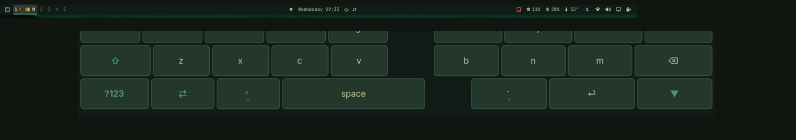

# tablet-toggle

[](https://www.buymeacoffee.com/ngek202)
[](https://plugins.omarchy.org/)



**For the moments your laptop becomes a tablet** — presenting, notes,
reading, lounging. One-tap tablet mode for Omarchy convertible users:
this bar-widget toggles it, shows its state, keeps itself healthy, and
**installs its dependency for you** if it's missing.

- **License:** GPL-3.0 (see `LICENSE`)
- **Version:** 0.2.0 (guarded tap, context-aware install, right-click interactive check/repair)

## What it does

- **Left-click** — toggles tablet mode on/off (highlighted when active)
- **Right-click** — health check in a floating terminal; offers repair
  only if something's broken
- **Either, when the package is missing** — installs the tablet-kbd
  package in a visible terminal

Requires the [tablet-kbd](https://github.com/ngek202/tablet-kbd) package
(SAM OSK engine, layouts, tablet wiring, verify script) — install it from
its repository, **or simply install this plugin and click the dimmed
widget**: it runs a pinned, visible install of the package for you
(nothing to copy-paste).

## Install

```bash
omarchy plugin add https://github.com/ngek202/tablet-toggle.git --enable
```

The platform prompts for the bar slot (recommended: right section).
Non-interactive:

```bash
omarchy plugin enable io.github.ngek202.tablet-toggle --section right
```

## Removal

```bash
omarchy plugin remove io.github.ngek202.tablet-toggle
```

The widget is self-contained — removing it leaves the tablet-kbd
package untouched: tablet mode keeps working via `SUPER+SHIFT+T`, and
SAM OSK via `SUPER+B`.

## Files

- `manifest.json` — plugin manifest (`bar-widget` kind)
- `BarWidget.qml` — toggle + state polling (`tablet-mode.sh status`, 2s)

## Usage

| Click | What it does |
|---|---|
| **Left** | Toggle tablet mode on/off |
| **Right** | Health check — offers repair only if something's broken |
| **Either** *(package missing)* | Installs the tablet-kbd package in a visible terminal |

The terminal walks you through everything — nothing to memorize.

## Notes

- **Never the sole exit:** tablet mode stays reachable without this
  widget (`SUPER+SHIFT+T`, 3-finger edge swipes) and SAM OSK dispatch
  (`SUPER+B`) is untouched — removing the widget removes nothing else.
- **Schema-compliant:** passes `omarchy plugin validate`.
